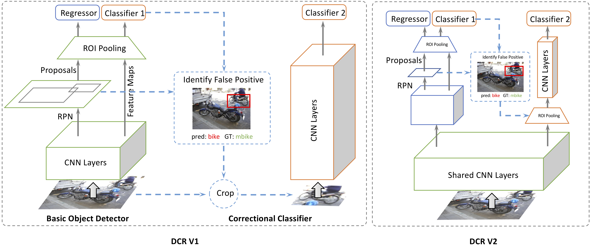
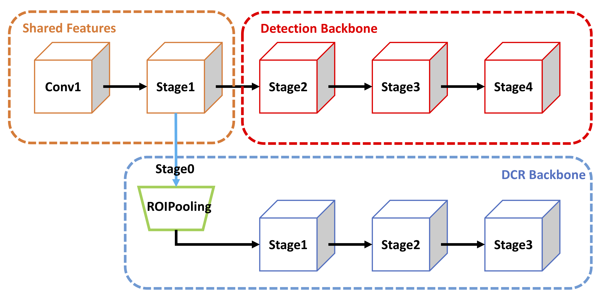

# Decoupled Classification Refinement

The is an official implementation of our ECCV2018 paper "Revisiting RCNN: On Awakening the Classification Power of Faster RCNN (https://arxiv.org/abs/1803.06799)"

## Introduction

**Decoupled Classification Refinement** is initially described in an [ECCV 2018 paper](https://arxiv.org/abs/1803.06799) (we call it DCR V1). 
It is further extended (we call it DCR V2) in a recent [tech report](https://arxiv.org/) (we will release it very soon). 
In this extension, we speed the original DCR V1 up by 3x with same accuracy. 
Unlike DCR V1 which requires a complicated two-stage training, DCR V2 is simpler and can be trained end-to-end. 

High level structure of DCR modules.  


Detailed DCR V2 module.  


## News
* \[2018/09/26\] Added all COCO results. Code will be released very soon with a new tech report. Stay tuned!

## Disclaimer

This is an official implementation for [Decoupled Classification Refinement](https://arxiv.org/abs/1803.06799) based on MXNet. It is worth noticing that:

  * The code is tested on official MXNet version 1.1.0 installed using pip.
  * We trained our model based on the ImageNet pre-trained [ResNet-v1-101](https://github.com/KaimingHe/deep-residual-networks) using a [model converter](https://github.com/dmlc/mxnet/tree/430ea7bfbbda67d993996d81c7fd44d3a20ef846/tools/caffe_converter). The converted model produces slightly lower accuracy (Top-1 Error on ImageNet val: 24.0% v.s. 23.6%).
  * This repository is based on [Deformable ConvNets](https://github.com/msracver/Deformable-ConvNets).

## License

© University of Illinois at Urbnana-Champaign, 2018. Licensed under an MIT license.

## Citing DCR

If you find Decoupled Classification Refinement module useful in your research, please consider citing:
```
@inproceedings{cheng18revisiting,
author = {Cheng, Bowen and Wei, Yunchao and Shi, Honghui and Feris, Rogerio and Xiong, Jinjun and Huang, Thomas},
title = {Revisiting RCNN: On Awakening the Classification Power of Faster RCNN},
booktitle = {The European Conference on Computer Vision (ECCV)},
month = {September},
year = {2018}
}
```

## Main Results

For simplicity, all train/val/test-dev refer to COCO2017 train/val and COCO test-dev.  
Notes:
* all FPN models are trained with OHEM following [Deformable ConvNets](https://github.com/msracver/Deformable-ConvNets).
* Prefix _D-_ means adding Deformable Convolutions and replacing ROIPooling with Deformable ROIPooling.
* **NO** multi-scale train/test, **NO** soft-NMS, **NO** ensemble! These are purely single model results without any test-time tricks!

#### COCO test-dev
|                                 | <sub>training data</sub> | <sub>testing data</sub>  | <sub>AP</sub>  | <sub>AP@0.5</sub> | <sub>AP@0.75</sub>| <sub>AP@S</sub> | <sub>AP@M</sub> | <sub>AP@L</sub> |
|---------------------------------|---------------|---------------|------|---------|---------|-------|-------|-------|
| <sub>Faster R-CNN (2fc), ResNet-v1-101 </sub>           | <sub>trainval</sub> | <sub>test-dev</sub> | 30.5 | 52.2    |   31.8  | 9.7  | 32.3  | 48.3  | 
| <sub> + DCR V1, ResNet-v1-101/152 </sub>           | <sub>trainval</sub> | <sub>test-dev</sub> | 33.9 | 57.9    |   35.3  | 14.0  | 36.1  | 50.8  | 
| <sub> + DCR V2, ResNet-v1-101 </sub>           | <sub>trainval</sub> | <sub>test-dev</sub> | 34.3 | 57.7    |   35.8  | 13.8  | 36.7  | 51.1  | 
| <sub>D-Faster R-CNN (2fc), ResNet-v1-101</sub> | <sub>trainval</sub> | <sub>test-dev</sub> | 35.2 | 55.1    | 38.2    | 14.6  | 37.4  | 52.6  |
| <sub> + DCR V1, ResNet-v1-101/152</sub> | <sub>trainval</sub> | <sub>test-dev</sub> | 38.1 | 59.7    | 41.1    | 17.9  | 41.2  | 54.7  |
| <sub> + DCR V2, ResNet-v1-101</sub> | <sub>trainval</sub> | <sub>test-dev</sub> | 38.2 | 59.7    | 41.2    | 17.3  | 41.7  | 54.6  |
| <sub>FPN, ResNet-v1-101</sub>            | <sub>trainval</sub> | <sub>test-dev</sub> | 38.8 | 61.7 | 42.6 | 21.9  | 42.1  | 49.7  | 
| <sub> + DCR V1, ResNet-v1-101/152</sub>            | <sub>trainval</sub> | <sub>test-dev</sub> | 40.7 | 64.4 | 44.6 | 24.3  | 43.7  | 51.9  | 
| <sub> + DCR V2, ResNet-v1-101</sub>            | <sub>trainval</sub> | <sub>test-dev</sub> | 40.8 | 63.6 | 44.5 | 24.3  | 44.3  | 52.0  | 
| <sub>D-FPN, ResNet-v1-101</sub> | <sub>trainval</sub> | <sub>test-dev</sub> | 41.7 | 64.0 | 45.9 | 23.7  | 44.7  | 53.4  |
| <sub> + DCR V1, ResNet-v1-101/152</sub> | <sub>trainval</sub> | <sub>test-dev</sub> | 43.1 | 66.1 | 47.3 | 25.8  | 45.9  | 55.3  |
| <sub> + DCR V2, ResNet-v1-101</sub> | <sub>trainval</sub> | <sub>test-dev</sub> | 43.5 | 65.9 | 47.6 | 25.8  | 46.6  | 55.9  |

#### COCO validation
|                                 | <sub>training data</sub> | <sub>testing data</sub>  | <sub>AP</sub>  | <sub>AP@0.5</sub> | <sub>AP@0.75</sub>| <sub>AP@S</sub> | <sub>AP@M</sub> | <sub>AP@L</sub> |
|---------------------------------|---------------|---------------|------|---------|---------|-------|-------|-------|
| <sub>Faster R-CNN (2fc), ResNet-v1-101 </sub>           | <sub>train</sub> | <sub>val</sub> | 30.0 | 50.9    |   30.9  | 9.9  | 33.0  | 49.1  | 
| <sub> + DCR V1, ResNet-v1-101/152 </sub>           | <sub>train</sub> | <sub>val</sub> | 33.1 | 56.3    |   34.2  | 13.8  | 36.2  | 51.5  | 
| <sub> + DCR V2, ResNet-v1-101 </sub>           | <sub>train</sub> | <sub>val</sub> | 33.6 | 56.7    |   34.7  | 13.5  | 37.1  | 52.2  | 
| <sub>D-Faster R-CNN (2fc), ResNet-v1-101</sub> | <sub>train</sub> | <sub>val</sub> | 34.4 | 53.8    | 37.2    | 14.4  | 37.7  | 53.1  |
| <sub> + DCR V1, ResNet-v1-101/152</sub> | <sub>train</sub> | <sub>val</sub> | 37.2 | 58.6    | 39.9    | 17.3  | 41.2  | 55.5  |
| <sub> + DCR V2, ResNet-v1-101</sub> | <sub>train</sub> | <sub>val</sub> | 37.5 | 58.6    | 40.1    | 17.2  | 42.0  | 55.5  |
| <sub>FPN, ResNet-v1-101</sub>            | <sub>train</sub> | <sub>val</sub> | 38.2 | 61.1 | 41.9 | 21.8  | 42.3  | 50.3  | 
| <sub> + DCR V1, ResNet-v1-101/152</sub>            | <sub>train</sub> | <sub>val</sub> | 40.2 | 63.8 | 44.0 | 24.3  | 43.9  | 52.6  | 
| <sub> + DCR V2, ResNet-v1-101</sub> | <sub>train</sub> | <sub>val</sub> | 40.3 | 62.9 | 43.7 | 24.3  | 44.6  | 52.7  |
| <sub>D-FPN + OHEM, ResNet-v1-101</sub> | <sub>train</sub> | <sub>val</sub> | 41.4 | 63.5 | 45.3 | 24.4  | 45.0  | 55.1  |
| <sub> + DCR V1, ResNet-v1-101/152</sub> | <sub>train</sub> | <sub>val</sub> | 42.6 | 65.3 | 46.5 | 26.4  | 46.1  | 56.4  |
| <sub> + DCR V2, ResNet-v1-101</sub> | <sub>train</sub> | <sub>val</sub> | 42.8 | 65.1 | 46.8 | 27.1  | 46.6  | 56.1  |

## Requirements: Software

1. MXNet from [the offical repository](https://github.com/dmlc/mxnet). We tested our code on MXNet version 1.1.0. Due to the rapid development of MXNet, it is recommended to checkout this version if you encounter any issues. We may maintain this repository periodically if MXNet adds important feature in future release.

2. Python 2.7. We recommend using Anaconda2 as it already includes many common packages. We do not support Python 3 yet, if you want to use Python 3 you need to modify the code to make it work.


3. Python packages might missing: cython, opencv-python >= 3.2.0, easydict. If `pip` is set up on your system, those packages should be able to be fetched and installed by running
	```
	pip install -r requirements.txt
	```
4. For Windows users, Visual Studio 2015 is needed to compile cython module.


## Requirements: Hardware

For experiments without FPN, our models are trained with NVIDIA GTX 1080TI (Required GPU Memory > 10G)  
For experiments with FPN, our models are trained with NVIDIA Tesla V100 (Required GPU Memory > 15G)

## Installation

1. Clone the Decoupled Classification Refinement repository, and we'll call the directory that you cloned as ${DCR_ROOT}.
```
git clone https://github.com/bowenc0221/Decoupled-Classification-Refinement.git
```

2. For Windows users, run ``cmd .\init.bat``. For Linux user, run `sh ./init.sh`. The scripts will build cython module automatically and create some folders.

3. Install MXNet following [this link](http://mxnet.incubator.apache.org/install/index.html?platform=Linux&language=Python&processor=GPU&version=v1.1.0)


## Preparation for Training & Testing

1. Please download **COCO2017** trainval datasets (**Note:** although COCO2014 and COCO2017 has exactly same images, their naming for images are different), and make sure it looks like this:

	```
	./data/coco/
	```

2. Please download ImageNet-pretrained ResNet-v1-101 model manually from [OneDrive](https://1drv.ms/u/s!Am-5JzdW2XHzhqMEtxf1Ciym8uZ8sg), and put it under folder `./model`. Make sure it looks like this:
	```
	./model/pretrained_model/resnet_v1_101-0000.params
	```

## Usage

1. All of our experiment settings (GPU #, dataset, etc.) are kept in yaml config files at folder `./experiments/faster_rcnn_dcr/cfgs`, `./experiments/fpn_dcr/cfgs`.
2. Eight config files have been provided so far, namely, Faster R-CNN(2fc) for COCO, Deformable Faster R-CNN(2fc) for COCO, FPN for COCO, Deformable FPN for COCO, respectively and their DCR versions. We use 4 GPUs to train all models on COCO.

3. To perform experiments, run the python scripts with the corresponding config file as input. For example, to train and test deformable convnets + DCR on COCO with ResNet-v1-101, use the following command
    ```
    python experiments/faster_rcnn_dcr/rcnn_end2end_train_test.py --cfg experiments/faster_rcnn_dcr/cfgs/resnet_v1_101_coco_trainval_dcn_dcr_end2end.yaml
    ```
    A cache folder would be created automatically to save the model and the log under `output/dcn_dcr/coco/`. (Note: the command above automatically run test after training)  
    To only test the model, use command
    ```
    python experiments/faster_rcnn_dcr/rcnn_test.py --cfg experiments/faster_rcnn_dcr/cfgs/resnet_v1_101_coco_trainval_dcn_dcr_end2end.yaml
    ```
4. Please find more details in config files and in our code.

## Contact
Bowen Cheng (bcheng9 AT illinois DOT edu)
